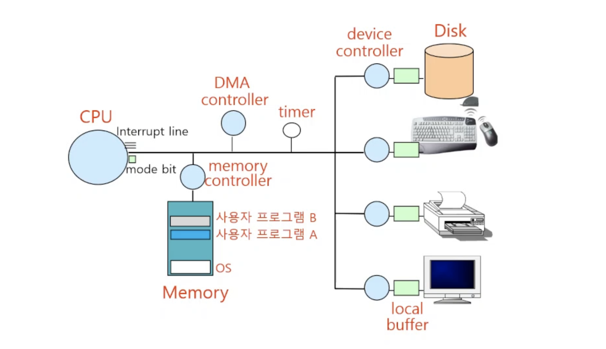

# 5강) 컴퓨터시스템 구조

## 컴퓨터 시스템 구조



## Mode Bit

- 사용자 프로그램의 잘못된 수행으로 다른 프로그램 및 운영체제에 피해가 가지 않도록 하기 위한 보호 장치 필요
- Mode Bit을 통해 하드웨어적으로 두 가지 모드의 operation 지원
    
    ```
    1 사용자 모드: 사용자 프로그램 수행
    0 커널 모드: OS 코드 수행 (= 모니터 모드, 시스템 모드)
    ```
    
    - 보안을 해칠 수 있는 중요한 기계어는 모니터 모드에서만 수행 가능한 ‘특권 명령'으로 규정
    - Interrupt나 Exception 발생시 하드웨어가 mode bit을 0으로 바꿈
    → I/O 장치를 건드리게 되면 Interrupt 발생
    → 사용자가 프로그래밍을 잘못 짜면 exception 발생
    - 사용자 프로그램에게 CPU를 넘기기 전에 mode bit을 1로 셋팅

## 타이머

- 특징
    - 정해진 시간이 흐른 뒤 운영체제에게 제어권이 넘어가도록 인터럽트를 발생시킴
    - 타이머는 매 클럭 틱 때마다 1씩 감소
    - 타이머 값이 0이 되면 타이머 인터럽트 발생
    - CPU를 특정 프로그램이 독점하는 것으로부터 보호
- 타이머는 time sharing을 구현하기 위해 널리 이용됨
- 타이머는 현재 시간을 계산하기 위해서도 사용

## Device Controller

- I/O device controller
    - 해당 I/O 장치 유형을 관리하는 일종의 작은 CPU
    - 제어 정보를 위해 control register, status register를 가짐
    - local buffer를 가짐 (일종의 data register)
- I/O는 실제 device와 local buffer 사이에서 일어남
- Device controller는 I/O가 끝났을 경우 Interrupt로 CPU에 그 사실을 알림
- 구분
    - device driver (장치구동기)
    : OS 코드 중 각 장치별 처리 루틴 → software
    - device controller (장치제어기)
    : 각 장치를 통제하는 일종의 작은 CPU → hardware

## 입출력(I/O)의 수행

- 모든 입출력 명령은 특권 명령으로 커널모드에서만 수행가능
- 사용자 프로그램은 어떻게 I/O를 하는가?
    - 시스템콜(system call) : 사용자 프로그램은 운영체제에게 I/O 요청
    - trap을 사용하여 인터럽트 벡터의 특정 위치로 이동
    - 제어권이 인터럽트 벡터가 가리키는 인터럽트 서비스 루틴으로 이동
    - 올바른 I/O 요청인지 확인 후 I/O 수행
    - I/O 완료 시 제어권을 시스템콜 다음 instruction으로 옮김

## 인터럽트(Interrupt)

- 인터럽트
    - 인터럽트 당한 시점의 레지스터와 program counter를 save 한 후 CPU의 제어를 인터럽트 처리 루틴에 넘긴다
- Interrupt (넓은 의미)
    - Interrupt (하드웨어 인터럽트): 하드웨어가 발생시킨 인터럽트
    - Trap (소프트웨어 인터럽트)
    - Exception: 프로그램이 오류를 범한 경우
    - System call: 프로그램이 커널 함수를 호출하는 경우
- 인터럽트 관련 용어
    - 인터럽트 벡터 : 해당 인터럽트 처리 루틴의 주소를 가지고 있음
    → 예를 들어서 키보드의 인터럽트인지, 마우스의 인터럽트인지 등등의 처리 루틴의 주소를 가지고 있음
    - 인터럽트 처리 루틴 (=Interrupt Service Routine, 인터럽트 핸들러): 해당 인터럽트를 처리하는 커널 함수

<aside>
✏️ 현대의 운영체제는 인터럽트에 의해 구동됨

</aside>

## 시스템 콜

- 사용자 프로그램이 운영체제의 서비스(I/O)를 받기 위해 커널 함수를 호출하는 것
- 소프트웨어적인 인터럽트

## 프로그램 실행


printf()와 scanf()는 커널밖에 쓸 수 없음

- 사용자 모드와 커널 모드가 번갈아 가면서 실행이 됨
- 사용자 모드에서 어떤 I/O를 건드리게 되면 (ex. printf(), scanf()…) 보안상의 이유 때문에 커널(OS)만 I/O 장치를 접근할 수 있기 때문에 커널 모드를 요청하는 system call 을 호출하게 됨

## DMA(Direct Memory Access)

- 빠른 입출력 장치를 메모리에 가까운 속도로 처리하기 위해 사용
- CPU의 중재 없이 device controller가 device의 buffer storage의 내용을 메모리에 block 단위로 직접 전송
→ CPU에 계속 interrupt가 걸리게 되면 성능저하(속도저하)가 발생함.
→ DMA controller는 이를 해결하기 위해 블록 단위로 바로 메모리에 전송함.
→ 블록 단위로 하는 이유는 예를 들어 키보드에서 ‘abcd’ 입력을 받으면 ‘a’, ‘b’, ‘c’, ‘d’ 다 따로 처리하는것이 오히려 더 힘들기 때문!
- 바이트 단위가 아니라 block 단위로 인터럽트를 발생시킴
- 하드디스크처럼 메모리보다는 느리지만 다른 장치들보다 빠른 장치를 사용할 때 DMA를 사용함


(좌) DMA가 없는 경우: CPU가 interruption을 다 처리해야한다.
(우) DMA가 있는 경우: CPU가 interruption을 신경 쓰지 않고 독립적으로 행동한다. (성능 좋아짐)

## 저장장치 계층구조


→ Primary: 휘발성 메모리(컴퓨터 전원이 꺼지면 날라감)

→ Secondary: 저장 장치(디스크) - not 휘발성

→ Register: CPU안에 있는 장치

→ Flash Memory: SSD, 요즘 노트북에 쓰임

## 메모리 로드


→ 실행파일 : a.out 또는 a.exe 같은 파일들

→ 실행이 된다는 것은 메모리에 적재가 된다는 뜻


→ 가상 메모리(Virtual memory)를 쓰는 목적: 저장장치의 차이가 있기 때문에 보조 장치를 사용하게 됨

→ 실행파일 A를 실행하게 되면 가상 메모리 공간에 프로세스 A의 Address space(주소공간)가 생기게 됨

→ stack: 함수의 호출되는 값, 함수의 리턴되는 값 들을 다 저장해 놓음

→ 가상 메모리를 쓰는 이유: physical memory에 실행 파일들이 다 올라가게 되면 상대적으로 메모리 공간이 너무 부족하기 때문에 가상 메모리에 전부 올려놓은 뒤 필요한 부분만 물리적 메모리에 올려놓게 된다.

→ Swap area: 프로세스가 끝나면 아예 메모리에서 버리는 것 보다는 Swap area에 올려놓고 나중에 또 호출이 일어나면 바로 swap area에서 호출할 수 있게 함(가상 메모리보다 swap area에서 호출하는게 더 빠름)

## 프로그램이 사용하는 함수

- 함수(function)
    - 사용자 정의 함수
        - 자신이 프로그램에서 정의한 함수
    - 라이브러리 함수
        - 자신의 프로그램에서 정의하지 않고 갖다 쓴 함수
        - 자신의 프로그램의 실행 파일에 포함되어 있다
    - 커널 함수
        - 운영체제 프로그램의 함수
        - 커널 함수의 호출 = 시스템 콜
    
    <aside>
    ✏️ 사용자 정의 함수 & 라이브러리 함수 : 프로세스 A의 address space의 code에 저장
    커널 함수: Kernal Address space의 code에 저장
    
    </aside>
