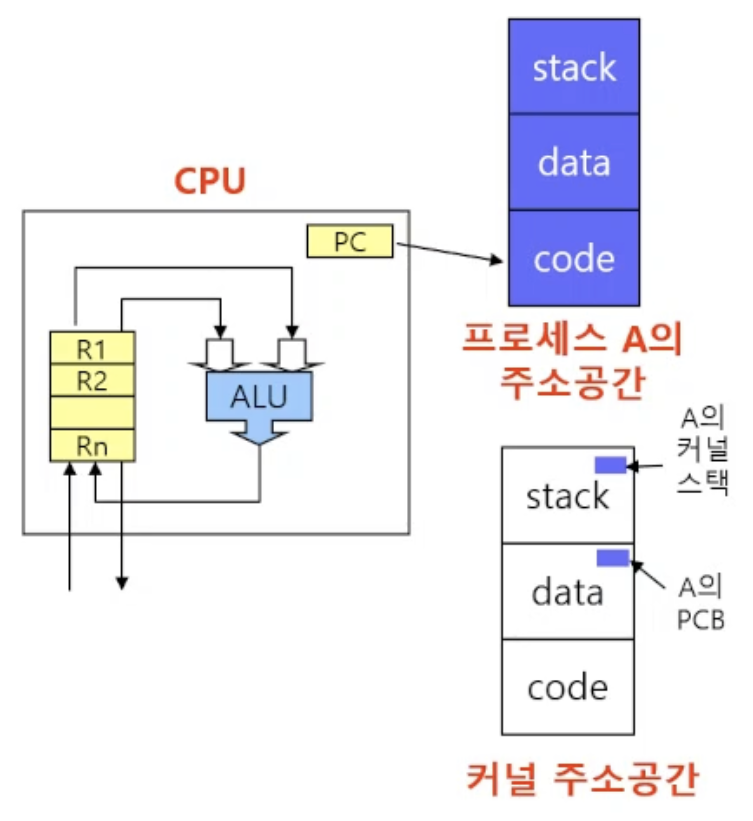

# 6강) 프로세스

## 프로세스의 개념

- “Process is a program in execution”
- 프로세스의 문맥(context)
    - CPU 수행 상태를 나타내는 하드웨어 문맥
        - Program Counter
        - 각종 register
    - 프로세스의 주소 공간
        - code, data, stack
    - 프로세스 관련 커널 자료 구조
        - PCB (Process Control Block)
        - Kernal stack
        



## 프로세스의 상태 (Process State)

- 프로세스는 상태(state)가 변경되며 수행된다
    - Running
        - CPU를 잡고 instruction을 수행중인 상태
    - Ready
        - CPU를 기다리는 상태(메모리 등 다른 조건을 모두 만족하고)
    - Blocked (wait, sleep)
        - CPU를 주어도 당장 instruction을 수행할 수 없는 상태
        - Process 자신이 요청한 event(예: I/O)가 즉시 만족되지 않아 이를 기다리는 상태
        - ex) 디스크에서 file을 읽어와야 하는 경우
    - New
        - 프로세스가 생성중인 상태
    - Terminated
        - 수행(execution)이 끝난 상태

## 프로세스 상태도


→ admit: 메모리에 올라갈 것이냐, 안올라갈 것이냐를 결정해줌 (장기 스케줄러가 하는 일!)

## 프로세스의 상태


→ 하드웨어에도 각각 queue가 존재함


→ Kernel Address space의 데이터 영역: 운영체제의 커널이 자신의 데이터 영역에 자료구조로 각각의 queue를 만들어서 관리 함

→ 이때 ready 상태인 큐에는 CPU권한을 주게 되고, blocked 된 상태는 권한을 주지 않고

## Process Control Block (PCB)

- 운영체제가 각 프로세스를 관리하기 위해 프로세스당 유지하는 정보
    
    → 각각의 프로세스에 대한 정보가 있는 자료구조
    

- 구성 요소 (구조체로 유지)
    1. OS가 관리상 사용하는 정보
        - Process state, Process ID (process number)
        - scheduling information, priority
    2. CPU 수행 관련 하드웨어 값
        - Program counter, registers
    3. 메모리 관련
        - Code, data, stack의 위치 정보
    4. 파일 관련
        - Open file descriptors…


## 문맥 교환 (Context Switch)

- CPU를 한 프로세스에서 다른 프로세스로 넘겨주는 과정
- CPU가 다른 프로세스에게 넘어갈 때 운영체제는 다음을 수행
    - CPU를 내어주는 프로세스의 상태를 그 프로세스의 PCB에 저장
    - CPU를 새롭게 얻는 프로세스의 상태를 PCB에서 읽어옴


- System call이나 Interrupt 발생시 반드시 context switch가 일어나는 것은 아님
(대부분은 문맥교환이 일어남)


```
(1)의 경우에도 CPU 수행 정보 등 context의 일부를 PCB에 save해야 하지만 문맥교환을 하는 (2)의 경우
그 부담이 훨씬 큼 (오베헤드가 걸리기 때문)
	eg. cache memory flush
```

## 프로세스를 스케줄링하기 위한 큐

- Job Queue
    - 현재 시스템 내에 있는 모든 프로세스의 집합
- Ready Queue
    - 현재 메모리 내에 있으면서 CPU를 잡아서 실행되기를 기다리는 프로세스의 집합
- Device Queues
    - I/O 디바이스의 처리를 기다리는 프로세스의 집합

```
📍 프로세스들은 각 큐들을 오가며 수행된다.
```

## 스케줄러 (Scheduler)

- Long-term scheduler (장기 스케줄러 or job scheduler)
    - 시작 프로세스 중 어떤 것들을 ready queue로 보낼지 결정
    - 프로세스에 memory(및 각종 자원)을 주는 문제
    - degree of Multiprogramming을 제어
    - time sharing system에는 보통 장기 스케줄러가 없음 (무조건 ready)
- Short-term scheduler (단기 스케줄러 or CPU scheduler)
    - 어떤 프로세스를 다음번에 running 시킬지 결정
    - 프로세스에 CPU를 주는 문제
    - 충분히 빨라야 함 (millisecond 단위)
- Medium-term scheduler (중기 스케줄러 or Swapper)
    - 여유 공간 마련을 위해 프로세스를 통째로 메모리에서 디스크로 쫓아냄 (swap 공간으로 쫓아냄)
    - 프로세스에게서 memory를 뺏는 문제
    - degree of Multiprogramming 을 제어

## 프로세스 상태

- Running
    - CPU를 잡고 instruction을 수행중인 상태
- Ready
    - CPU를 기다리는 상태(메모리 등 다른 조건을 모두 만족하고)
- Blocked (wait, sleep)
    - I/O 등의 event를 (스스로) 기다리는 상태
    - (예) 디스크에서 file을 읽어와야 하는 경우
- Suspended (stopped)
    - 외부적인 이유(ex. 중기 스케줄러에 의해서 멈춰진 경우)로 프로세스의 수행이 정지된 상태
    - 프로세스는 통째로 디스크에 swap out 된다
    - 아무 일도 하고 있지 않은 상태
    - (예) 사용자가 프로그램을 일시 정지시킨 경우 (break key) 시스템이 여러 이유로 프로세스를 잠시 중단시킴 (메모리에 너무 많은 프로세스가 올라와 있을 때)

```
Blocked : 자신이 요청한 event가 만족되면 Ready
Suspended : 외부에서 resume해 주어야 Active
```

## 프로세스 상태도 (자세한 버전)


## Thread

> *A thread (or lightwight process) is a basic unit of CPU utilization*
> 
- Thread의 구성
    
    
    
    - Program counter
    - Register set
    - Stack space
- Thread가 동료 thread와 공유하는 부분(=task)
    - Code section
    - Data section
    - OS resources
- 전통적인 개념의 Heavyweight process는 하나의 thread를 가지고 있는 task로 볼 수 있다.

## Multi-Thread 사용시 장점

- 다중 스레드(Multi-thread)로 구성된 태스크 구조에서는 하나의 서버 스레드가 blocked(waiting) 상태인 동안에도 동일한 태스크 내의 다른 스레드가 실행(running)되어 빠른 처리를 할 수 있다.
→ ex. 웹서버(네이버, 다음 …)에서 사용자가 웹사이트를 방문하게 되면 HTML 패킷을 전송하게 되는데 이때 이미지나 영상을 처리하는 스레드와 텍스트를 처리하는 스레드가 따로 있어서 텍스트를 먼저 처리하고 계속 이미지 스레드와 영상 스레드를 처리함. 그래서 사용자는 웹서버에 접속을 하게 되면 텍스트를 먼저 보고 그 다음에 하나씩 이미지와 영상이 로딩되는 경험을 겪음.
- 동일한 일을 수행하는 다중 스레드가 협력하여 높은 처리율(throughput)과 성능 향상을 얻을 수 있다.
- 스레드를 사용하면 병렬성을 높일 수 있다.


## Benefits of Threads

- Responsiveness
    - ex. multi-threaded Web
- Resource Sharing
    - n threads can share binary code, data, resource of the process
- Economy
    - creating & CPU switching thread (rather than a process)
- Utilization of MP Architectures
    - each thread may be running in parallel on a different processor
